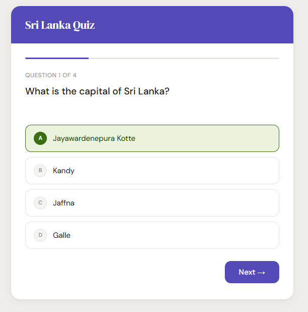

# 🇱🇰 Sri Lanka Quiz App

A simple, interactive browser-based quiz about Sri Lanka — built with vanilla HTML, CSS, and JavaScript. No frameworks, no dependencies.

---

## 📸 Preview



---

## 🚀 Features

- **4 questions** covering Sri Lankan capital, wildlife, religion, and food
- **Progress bar** that fills as you advance through questions
- **Instant answer feedback** — correct answers highlight green, wrong ones red
- **Score screen** with emoji feedback based on your result
- **Play Again** button to restart without reloading the page
- Fully **responsive** and works in any modern browser

---

## 📁 Project Structure

```
quiz-app/
├── index.html        # App markup and layout
├── css/
│   └── style.css     # All styles (DM Sans + DM Serif Display fonts)
└── script.js         # Quiz logic (questions, scoring, state)
```

---

## 🛠️ Getting Started

No build tools or installs needed.

1. **Clone the repository**
   ```bash
   git clone https://github.com/hasitha-ramesh/quiz-app-javascript.git
   ```

2. **Open in your browser**
   ```bash
   cd your-repo-name
   open index.html
   ```
   Or just double-click `index.html` — it runs entirely in the browser.

---

## 🧠 How It Works

- Questions and answers are stored as an array of objects in `script.js`
- On each question, answer buttons are dynamically created and injected into the DOM
- Clicking an answer disables all buttons and highlights the correct/incorrect choices
- The progress bar width is updated via inline styles controlled by JS
- The score screen is rendered by replacing the question element's `innerHTML`

---

## ➕ Adding More Questions

Open `script.js` and add a new object to the `questions` array:

```js
{
  question: "Your question here?",
  answers: [
    { text: "Correct answer", correct: true },
    { text: "Wrong answer",   correct: false },
    { text: "Wrong answer",   correct: false },
    { text: "Wrong answer",   correct: false },
  ],
}
```

The quiz will automatically adjust the progress bar and question counter.

---

## 🎨 Customization

All design tokens (colors, fonts, border radii, shadows) are defined as CSS variables at the top of `style.css` under `:root`. You can retheme the entire app by changing those values.

```css
:root {
  --purple-600: #534AB7;   /* primary accent */
  --green-600:  #3B6D11;   /* correct answer */
  --red-600:    #A32D2D;   /* wrong answer   */
}
```

---

## 📦 Technologies Used

| Technology | Purpose |
|---|---|
| HTML5 | Structure and markup |
| CSS3 | Styling and layout |
| Vanilla JavaScript | Quiz logic and DOM manipulation |
| Google Fonts | DM Sans & DM Serif Display typefaces |

---

